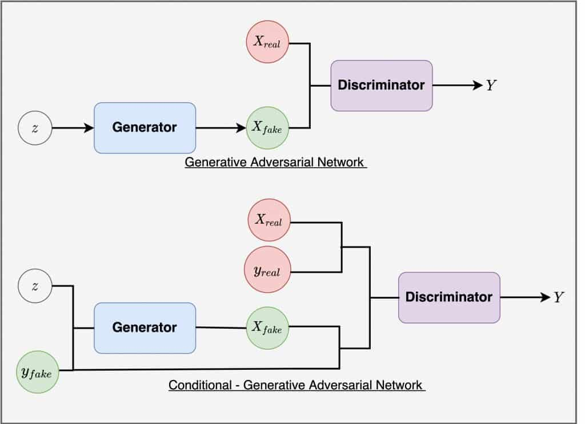
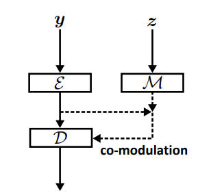
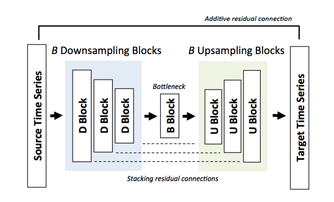
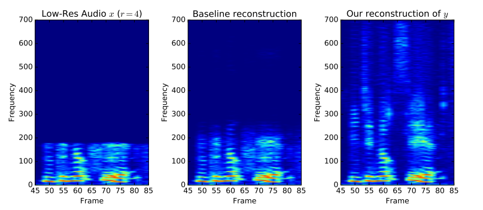
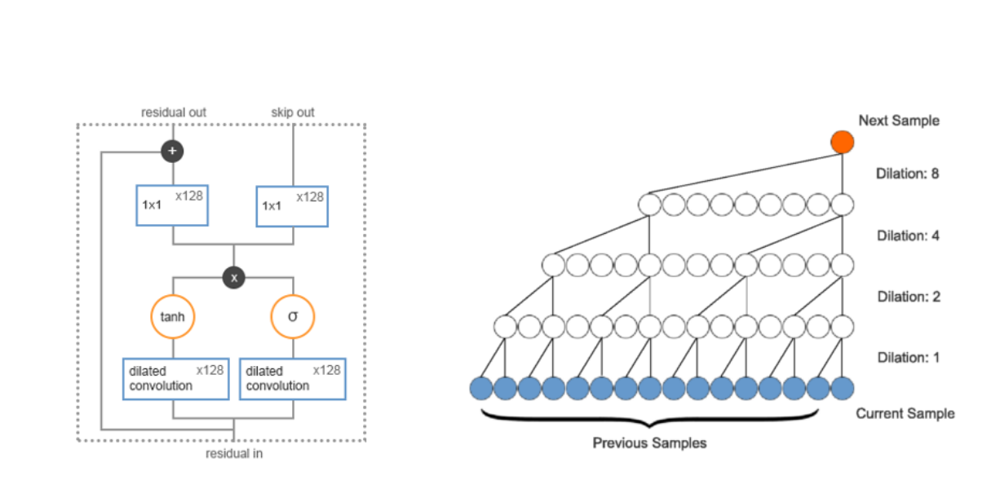
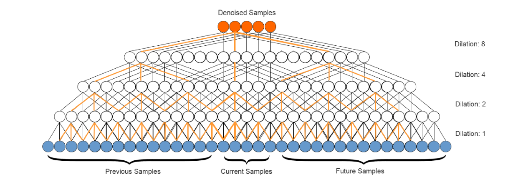

# Sound Resurrection

## Zarys projektu

- Projekt dotyczy tematu uzupełniania próbek dźwiękowych o brakujące informacje, stosując algorytmy służące do generowania dźwięku w domenie czas-częstotliwość. 
- Zamierzony trend w kwestii domeny to konferencje (np. na platformie MS Teams) w języku angielskim.
- Nacisk kładziony będzie na wypowiedziach jednego mówcy w analizowanych chwilach czasowych

#### Input:

- Niekompletny zbiór sampli skonwertowany do formy spektrogramu
- Dźwięk o zmniejszonej częstotliwości (zbyt mały sampling rate)

#### Zadania modelu:

- Generowanie brakujących części spektrogramu
- Uzupełniona treść musi być zgodna z nieuszkodzonymi częściami
- Pożądana jest duże różnorodność w kwestii generacji
- Upsampling dźwięku o słabej jakości
- Odtwarzanie wyższych częstotliwości na podstawie niższych (Przesuwanie granicy Nyquist Frequency)

## Źródło danych i preprocessing

#### Źródło:

- Surowe próbki dźwiękowe wzięte z pociętych fragmentów konferencji w języku angielskim
- W przypadku większego zapotrzebowania na dane, podzbiory darmowych datasetów

#### Preprocessing:

- Analizowane kilkusekundowe próbki do zwiększania jakości dźwięku, krótsze do generacji
- Dźwięk surowy konwertowany do formy spektrogramu i ucinany tak, aby zasymulować efekt "scinania"
- Wstępna analiza barwy dźwięku dla "voiced frames"
- Mozliwy rozdział pomiędzy glottal-source i vocal-tract w celu ograniczenia zadań generatora (głośność i ton mergowany po generacji)

## Planowana architektura

- Główna inspiracja w kwestii architektury pochodzi z badań w temacie Image Completion, w szczególności model Co-Modulated GAN, ze względu na jego różnorodność generowania oraz zgodność z inputem.
- Model dostosowany do tematu dźwięku z możliwym użyciem warstw rekurencyjnych zamiast konwolucyjnych. 
- Preferowane metryki zgodne z human-evaluation, główna inspiracja: *PAIRED/UNPAIRED INCEPTION DISCRIMINATIVE SCORE*
- Kod modelu napisany w Tensorflow
- Obróbka i zapis/odczyt dźwięku z użyciem biblioteki librosa

## Wstępny harmonogram
| Data rozpoczęcia      | Działanie                    | Opis     |
|------------|------------------------------|-------------------------------|
|2023-10-6 | Literatura | Przygotowanie potrzebnych artykułów i studiowanie wiedzy
| 2023-10-20| Zbieranie i przygotowanie  danych   | Surowe próbki dźwiękowe z konferencji, konwersja do formy spektrogramu |
| 2023-11-03 | Prototypy modeli  | Implementacja modeli GAN, eksperymenty z architekturą |
| 2023-11-10 | Uczenie modeli goraz romadzenie metryk | Trening modeli na dostępnych danych, ocena jakości generowanych próbek|
| 2023-12-15 | Optymalizacja i ewaluacja | Doskonalenie modeli i metodyki, ocena wyników |

## Wstępny spis źródeł

-  ["MelNet: A Generative Model for Audio in the Frequency Domain"](https://arxiv.org/abs/1906.01083) - Sean Vasquez, Mike Lewis
-  ["Large Scale Image Completion via Co-Modulated Generative Adversarial Networks"](https://arxiv.org/abs/2103.10428)- Shengyu Zhao et al.
-  ["GANSynth: Adversarial Neural Audio Synthesis"](https://arxiv.org/abs/1902.08710)- Jesse Engel et al.
-  ["A Literature Review of WaveNet: Theory, Application and Optimization"](https://www.researchgate.net/publication/333135603_A_Literature_Review_of_WaveNet_Theory_Application_and_Optimization)- Jonathan Boilard et al.
-  ["A Style-Based Generator Architecture for Generative Adversarial Networks"](https://arxiv.org/abs/1812.04948)- Tero Karra et al.
-  ["Progressive Growing of GANs for Improved Quality, Stability, and Variation"](https://arxiv.org/abs/1710.10196)- Tero Karra et al.

# Analiza najnowszych rozwiązań problemu

## Uzupełnianie dźwięku

### Conditional GAN

- Na generowanie treści wpływa wektor modulujący, utworzony z inputu
- Architektura nadaje się do tematu Image Completion
- Zbieżność ze stylem/treścią danych na wejściu
- Słabe zdolności generacyjne
- Wady architektury widoczne w momencie, gdy zakryty obszar na wyjściowych danych (obraz, spektrogram) jest duży i/lub nieregularny

### Co-Modulated GAN

- Wektor determinujący generowaną treść jest połączeniem dwóch wektorów:
    - Zmapowany wektor wysamplowany z losowego rozkładu (odpowiednika losowanego latent space'u w VAE)
    - Zakodowany obraz wejściowy
- Architektura bierze pod uwagę zarówno wygląd obrazu wejściowego jak i "bogactwo" generacji

## Upsampling

### Architektura typu downsample->upsample

- Architektura niesymetryczna (input o mniejszej rozdzielczości niż output)
- Wejście w time-domain
- Podczas treningu wykorzystywane są sztucznie pogorszone fragmenty dźwięku
- "Order 8 Chebyshev type I low-pass filter" + downsampling
- Połączenia rezydualne między poszczególnymi warstwami w hierarchii znacząco poprawiają jakość uczenia

### Generacja wysokich częstotliwości z niskich

- Wejściowy dźwięk o obniżonej częstotliwości "przechodzi" przez warstwy konwolucyjne 1D
- Bez wykorzystania auto-regresji model rozszerza sample dźwiękowe i pozwala na ekstrakcję wyższych częstotliwości
- Architektura ma potencjał do przewyższenia innych używanych technik, używających interpolacji bez wykorzystania ML

## Denoising

### Klasyczne podejście do WaveNet

- Sample generowane na podstawie poprzednich wartości
- Połączenia rezydualne
- Kwantyzacja outputu (mu-law)
- Dilated convolutions 1D

### WaveNet po usunięciu Causality

- Symetryczne wpływanie na sample w nowej warstwie
- Brak kwantyzacji z powodu zbyt dużego wzmocnienia szumu w outpucie
